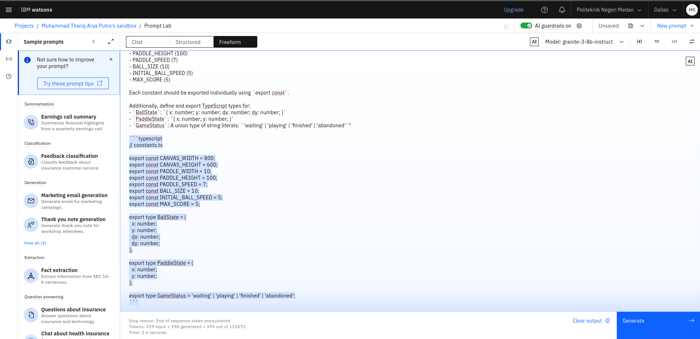
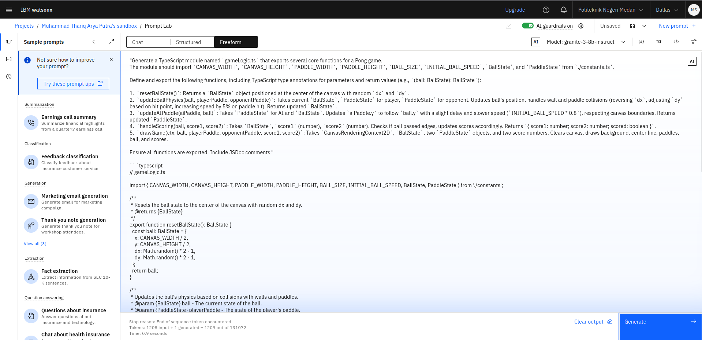
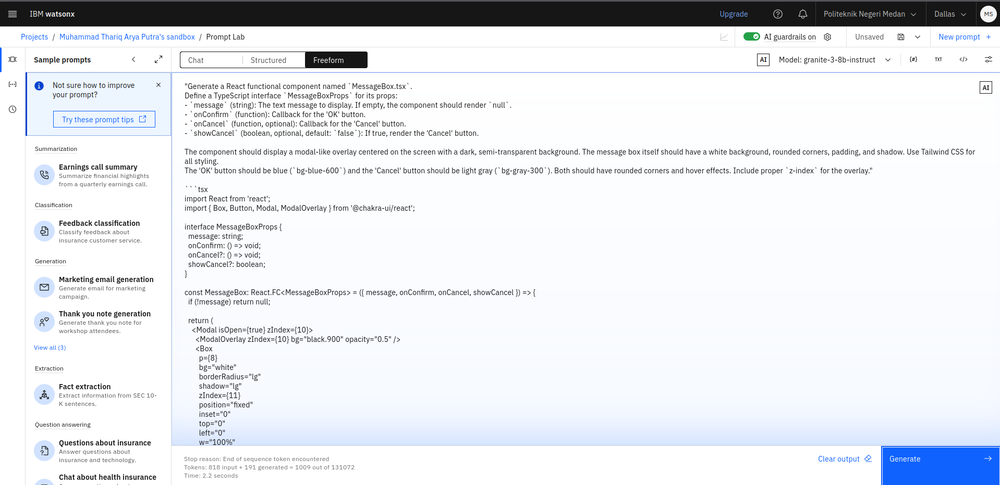
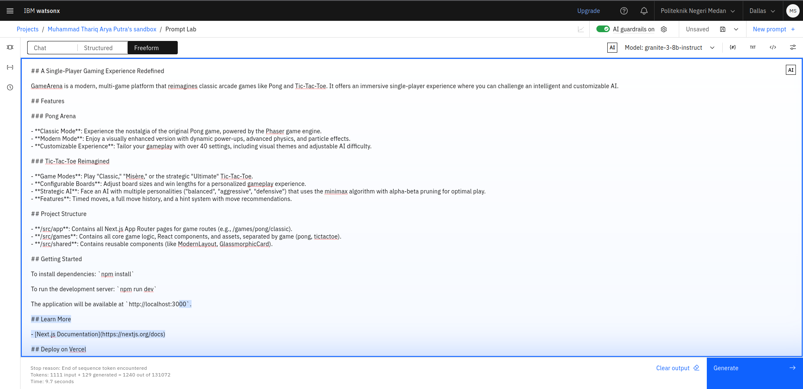

# GameArena

## A Single-Player Gaming Experience Redefined

GameArena is a modern, multi-game platform that reimagines classic arcade games like Pong and Tic-Tac-Toe. It offers an immersive single-player experience where you can challenge an intelligent and customizable AI.

## Technologies Used

GameArena is built with a modern and efficient stack to deliver a high-performance gaming experience:

* **Bun:** An all-in-one JavaScript runtime, bundler, and package manager, chosen for its exceptional speed and efficiency in development and production.
* **TypeScript:** A superset of JavaScript that adds static typing, enhancing code quality, maintainability, and developer productivity for complex applications.
* **Next.js:** The React framework for building fast web applications, providing features like server-side rendering (SSR), static site generation (SSG), and API routes.

## Features

### Pong Arena

* **Classic Mode**: Experience the nostalgia of the original Pong game, powered by the Phaser game engine.
* **Modern Mode** (In Development): Enjoy a visually enhanced version with dynamic power-ups, advanced physics, and particle effects. Please note this mode is still under active development and may have incomplete features or bugs.
* **Customizable Experience**: Tailor your gameplay with over 40 settings, including visual themes and adjustable AI difficulty.

### Tic-Tac-Toe Reimagined

* **Game Modes**: Play "Classic," "Misère," or the strategic "Ultimate" Tic-Tac-Toe.
* **Configurable Boards**: Adjust board sizes and win lengths for a personalized gameplay experience.
* **Strategic AI**: Face an AI with multiple personalities ("balanced", "aggressive", "defensive") that uses the minimax algorithm with alpha-beta pruning for optimal play.
* **Features**: Timed moves, a full move history, and a hint system with move recommendations.

---

## Important Warnings & Current Limitations

Please be aware of the following known limitations and features currently under development:

* **No Sound/Music:** GameArena currently **does not feature any in-game music or sound effects.** This is a planned future enhancement.
* **Single-Player Only:** The platform is designed exclusively for a single-player experience against AI. **Multiplayer functionality is not yet implemented** and is a long-term goal.
* **Modern Pong Mode Status:** The "Modern Mode" for Pong is actively being developed. While playable, it may contain **bugs, incomplete features, or undergo significant changes** in future updates. Your feedback is welcome!

---

## AI Generation with IBM Granite

GameArena leverages the **IBM Granite** large language model (LLM) to assist in various aspects of development and content generation, showcasing the power of AI in modern software projects. Specifically, Granite has been instrumental in:

1.  **Accelerating Game Logic & Core Constants:** IBM Granite significantly jumpstarted the development of Pong by generating foundational elements. It provided initial structures for the `PONG_GAME_SETTINGS` (defining game dimensions, paddle, and ball properties), as well as the core `PongGameLogic` class outline, setting a robust groundwork for the game's mechanics.
    

      
      
    

    *Description: Illustrations showcasing IBM Granite's contribution to defining fundamental game constants and structuring the core game logic for Pong.*

2.  **Generating UI Components:** For reusable UI elements like the `MessageBox` component, IBM Granite provided valuable assistance in structuring the component, suggesting props, and even generating initial styling classes. This accelerates frontend development and ensures consistency.
    
    *Description: A visual representation of how IBM Granite aids in creating reusable React components, exemplified by the `MessageBox` component.*

3.  **Assisting with Documentation:** A significant portion of this `README.md` file, including structure suggestions, feature explanations, and even the initial drafts for sections like "Technologies Used" and "Important Warnings," were guided and refined with the help of IBM Granite.
    
    *Description: An example demonstrating IBM Granite's contribution to crafting clear and comprehensive project documentation.*

---

## Project Structure

* **/src/app**: Contains all Next.js App Router pages for game routes (e.g., /games/pong/classic).
* **/src/games**: Contains all core game logic, React components, and assets, separated by game (pong, tictactoe).
* **/src/shared**: Contains reusable components (like ModernLayout, GlassmorphicCard, **MessageBox**).

## Getting Started

To install dependencies: `npm install`

To run the development server: `npm run dev`

The application will be available at `http://localhost:3000`.

## Learn More

* [Next.js Documentation](https://nextjs.org/docs)

## Deploy on Vercel

GameArena is built with Next.js, which seamlessly integrates with Vercel for deployment. To deploy your application, follow the [Vercel documentation](https://vercel.com/docs).
